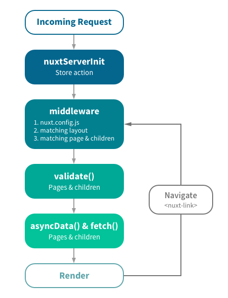

## NUXT简介与优势
* [官方文档](https://zh.nuxtjs.org/)
* 基于vue.js
* 自动代码分层
* 服务端渲染
* 强大的路由功能，支持自动生成路由，支持异步数据
* 静态文件服务
* ES6/ES7 语法支持
* 打包和压缩 JS 和 CSS
* HTML头部标签管理
* 本地开发支持热加载
* 集成ESLint
* 支持各种样式预处理器： SASS、LESS、 Stylus等等

## 安装与使用
* 快速入手
	* 利用vue-cli
	* vue init nuxt-community/starter-template <project-name>
	* npm install
	* npm run dev
* 徒手搭建
	* 新建package.json
	
	```
	{
	  "name": "my-app",
	  "scripts": {
		    "dev": "nuxt"
		}
	}
	```
	* npm install --save nuxt
	* npm run dev

## 流程图与生命周期
 
 
 * 调用 nuxtServerInit 方法
	* 当请求打入时，最先调用的即是 nuxtServerInit 方法，可以通过这个方法预先将服务器的数据保存，如已登录的用户信息等。另外，这个方法中也可以执行异步操作，并等待数据解析后返回。
* Middleware 层
	* 读取 nuxt.config.js 中全局 middleware 字段的配置，并调用相应的中间件方法 匹配并加载与请求相对应的 layout 调用 layout 和 page 的中间件方法
* 调用 validate 方法
	* 在这一步可以对请求参数进行校验，或是对第一步中服务器下发的数据进行校验，如果校验失败，将抛出 404 页面。
* 调用 fetch 及 asyncData 方法
	* 这两个方法都会在组件加载之前被调用，它们的职责各有不同， asyncData 用来异步的进行组件数据的初始化工作，而 fetch 方法偏重于异步获取数据后修改 Vuex 中的状态。

## nuxt.config.js配置
* head: 可以在这个配置项中配置全局的 head ，如定义网站的标题、 meta ，引入第三方的 CSS、JavaScript 文件等


