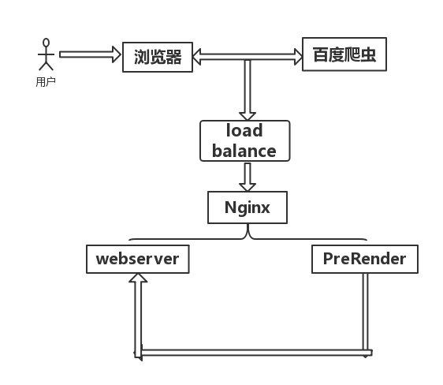

# PerRender-预渲染架构，提高AngularJS SEO 
* JavaScript框架的优势
	* 前端后端独立开发
	* JavaScript框架+RESTFUL的API（或微服务架构）
	* SPA（Single Page Application）
	* 提高开发效率
* JavaScript框架的劣势
	* 使用JavaScript框架对前台尤其是需要支持搜索引擎的页面是很有问题的，这是因为我们使用这些框架基本上都是基于虚拟元素或属性和JavaScript绑定JSON对象，都是SEO不友好的。很多搜索引擎，社交媒体，爬虫甚至不支持抓取JavaScript的网页。  
* 解决方案
	* 使用PreRender.io预渲染页面（PreRender.io通过执行页面上的JavaScript，然后呈现给搜索引擎爬虫）
	
# 什么是PerRender预渲染
	* 基于Node.js 
	* 兼容所有的JavaScript框架和库
	* 让你的JavaScript网站支持搜索引擎和社交媒体
	* 采用PhantomJS渲染JavaScript网页然后呈现为HTML
	* 通过实现prerender服务层来缓存访问过的页面，提高性能。
	* 利用JavaScript API脚本化的Headless WebKit
	* 具有  速度快  和  支持Native  的各种Web标准：DOM处理，CSS选择器，JSON，Canvas和SVG
* PreRender中间件（用中间件实现应用程序内部逻辑的PreRender库）
	* [NodeJS Express](https://github.com/prerender/prerender-node)
	* [Ruby on Rails](https://github.com/prerender/prerender_rails)
	* [Java](https://github.com/greengerong/prerender-java)
	* [ASP.NET MVC](https://github.com/greengerong/Prerender_asp_mvc)
	* [PHP Zend Framework](https://github.com/zf-fr/zfr-prerender)
	* [Apache](https://gist.github.com/thoop/8072354)
	* [Nginx](https://gist.github.com/thoop/8165802)
* [中间件地址](https://prerender.io/documentation/install-middleware)
* Apache和Nginx的是服务器容器级中间件，其他都是应用层面的中间件
* [官方网站](https://prerender.io/)
* [GitHub网址](https://github.com/prerender)

# PreRender预渲染流程

* 用户浏览：
	* 用户输入url发生在浏览器与负载均衡之间，负载均衡将用户分配到不同的NGINX服务器上，然后浏览相关的站点
* 爬虫：
	* 爬虫爬取站点网页，服务器能够反应到该条请求是来自爬虫，会将爬虫自动引流到PreRender，通过PreRender的预渲染获取到站点的网页。

### 为什么要做预渲染
* 传统站点通过ajax请求获取站带你数据和文件，而爬虫不会等待ajax请求的结果，这样通过传统的方法就不能做到SEO优化。

### PreRender的本质
* PreRender本质上是一个webkit内核的浏览器，在PreRender访问web站点，渲染HTML并返回给爬虫。
* 注：爬虫在PreRender访问站点，只需将最重要的部分让爬虫看到就好，一些底层的js交互可以不让爬虫取到，现在很多网站核心部分做了处理防止爬虫爬取到。

# PreRender.io 预渲染解决方案
* 方案一： 应用层

	通过中间件实现对应用程序级别prerender.io逻辑（即Express NodeJS中间件，Ruby on Rails的中间件，ASP.NET MVC中间件，...）
	* Http请求到达
	* 应用程序将检查Http请求是否来自爬虫（User Agent）。
	* 如果请求来自爬虫，那么appliaction将调用prerender服务，把原来的URL作为查询字符串。 
		* 预渲染服务将调用应用程序。
		* 应用程序返回原始的HTML用JavaScript逻辑的prerender服务。
		* 预渲染服务将执行内部HTML的JavaScript(与浏览器类似)。
		* 预渲染服务将最终的HTML返回到应用程序。
		* Appliaction将最终的HTML返回到浏览器。
	* 如果Http请求来自普通用户，应用程序将执行输出，并发送回浏览器。

* 方案二： 服务器容器级别

	通过使用URL重写中间件，实施服务器容器级别prerender.io逻辑（i.e. Apache，Nginx，IIS。

	* Http请求到达
	* 服务器容器（如Apache，Nginx，IIS）将检查Http请求是否来自爬虫（User Agent）。
	* 如果Http请求来自爬虫，然后重写URL（将原始URL作为查询字符串）预呈现服务。 
		* 预渲染服务将调用应用程序 
		* 应用程序返回JavaScript逻辑原始的HTML 
		* 预渲染服务将执行内部HTML的JavaScript，与浏览器类似
		* 预渲染服务将返回最终的HTML服务器容器（Apache，Nginx，IIS）。
	* 如果Http请求来自普通用户，然后将流量重定向到应用程序。应用程序将执行并返回输出到服务器容器。

* 方案三：网络级别

	我们通过负载均衡的代理实现网络级prerender.io逻辑，i.e. HAProxy：
	* Http请求到达
	* 负载均衡代理会检查Http请求是否来自爬虫（User Agent）。
	* 如果Http来自爬虫，然后将流量重定向（将原始URL作为查询字符串）预呈现服务。 
		* 预渲染服务将调用应用程序 
		* 应用程序返回包含JavaScript原始的HTML 
		* 预渲染服务将执行内部HTML的JavaScript，与浏览器类似
		* 预渲染服务将最终的HTML返回给负载平衡的代理。
	* 如果Http请求来自普通用户，将流量重定向到应用程序。应用程序将执行并返回输出到负载平衡的代理。

### 解决方案比较

以上三种不同的解决方案是在不同的级别解决相同的问题，但是他们有着不同的性能结果

* 方案一：应用层
	* 该解决方案易于实施，易于调试，但它也加重应用程序负载，因为应用程序需要等待的prerender服务调用的应用程序和执行JavaScript，这将需要大量的时间等待，并且等待时间取决于它的JavaScript逻辑的复杂性。因此，这种解决方案的瓶颈是应用程序。
	
	* 如果的prerender服务已关闭，会影响普通用户访问体验（长时间的请求预呈现服务，消耗应用程序和服务器容器资源）。
* 方案二：服务器容器级别
	*  这种解决方案利用URL重写逻辑来将负载瓶颈从应用级移到IIS级，这种方案提高了应用程序的灵活性。
	
	* 如果的prerender服务已关闭，会影响普通用户访问体验是（长时间的请求预呈现服务，消耗服务器容器资源）。
* 方案三： 网络级别
	* 这种解决方案将在最高水平通过使用负载平衡来实现，在网络级，因此，存在于服务器容器和应用程序无瓶颈，因为它移动到负载平衡。 

   * 有了这个解决方案，甚至的prerender服务关闭，也不会影响到普通用户的接入体验
 
### 性能问题
* 无论我们将要使用那种解决方案，我们总应该思考如何提高性能，因为执行JavaScript逻辑总会比执行服务器端逻辑花费更长的时间，而且不可预见。

* 在另一方面，如果我们只重定向爬虫的Http请求到预渲染服务，我们不需要提供最新信息给爬虫，我们可以使用prerender的缓存服务来提高性能，我们可以缓存爬虫访问过的页面12小时-1天

# 写在后面的话
* Google现在有现成的PreRender组件，仅需提供一个域名即可。
* PreRender不仅仅是搭建一个空服务，还要有周边服务，是单独的一个项目，在node的底层

