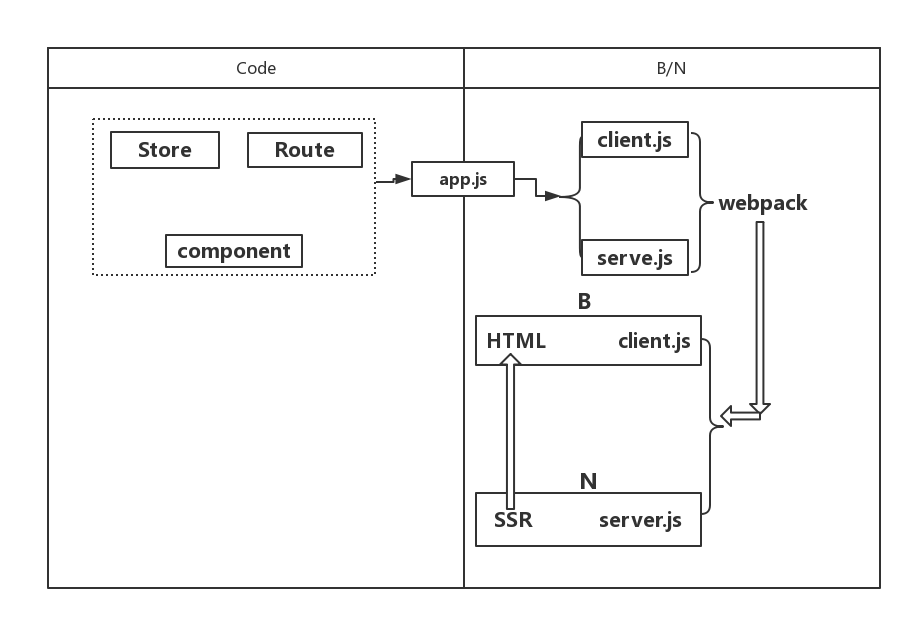

# 为什么要做SSR服务器渲染
* 单页应用虽然在交互体验上比传统多页更友好，但它也有一个天生的缺陷，就是对搜索引擎不友好，不利于爬虫爬取数据。
* 使用vue-ssr可以把数据渲染成HTML, 并在首屏展示, 用户体验好, 传统的前端vue, 服务器第一次请求只返回#app的空DOM, 当js和ajax请求完成, 才会展示, 体验差
* 前端用的是vue, 后端渲染用vue-ssr,可以无缝的和前端连接起来

# SSR服务器渲染

* 简单来说就是，服务器将每个要展示的页面都运行完成后，将整个相应流传送给浏览器，所有的运算在服务器端都已经完成，浏览器只需要解析 HTML 就行。

### SSR服务器渲染流程
* code部分中，Store实则为VUEX，通过app.js进行整合
* 产生两个入口文件：client.js和server.js（两个entry文件，对应的是webpack.config中的entry，即打包入口文件，也就是分别代表服务器端所运行代码的入口和浏览器端所运行代码的入口文件）
	* server entry: 根据路由状态，返回渲染完成后相应的组件
	* clinet entry: 将应用直接挂载到 DOM 上
* webpack将两个入口文件打包处理
* 打包后生成两个逻辑文件client.js和server.js，这两个js文件与入口文件不同，client.js是客户端的逻辑文件，而server.js是服务器端的逻辑文件，但是这两个js文件的逻辑完全相同
* 服务器端的server.js通过SSR服务器渲染将HTML渲染到客户端
	* 到这里才要用上 vue 为支持 ssr 所依赖的库 vue-server-renderer。
	* 通过 vue-server-renderer 提供的 API 就能容易地根据 url 生成对应的组件树，然后将它返回给客户端。
	* 这里要注意，因为用的是 webpack 打包后的文件，所以只能用 createBundleRenderer 而不能用 createRenderer 来创建 renderer。
	* 创建 renderer 的时候还可以为它配置 cache

这样从 SPA 到 SSR 的变更就完成了，通过浏览器访问看看是不是已经将页面整个返回了。

### 所有的页面都适合做SSR么
* 当然不是, 他的最最主要作用是首屏渲染, 其他都是次要的, 比如有3个tab页签, 只有第一个页签是首屏展示的, 其他两个是通过点击才展示数据, 那这样就没有必要把另外两个页签的数据也取出来, 做vue-ssr, 这样会增加服务器端的压力和流量

### 数据在服务器端已经取到了，为什么还要共享到前端
* 服务端把数据取到之后，渲染成HTML返回到前端，这样前端就用不到这些数据了，取数据只为了渲染，这种情况只适用于纯静态的渲染，就是拿到10条数据，渲染成一个列表，这个列表上没有交互，没有click、hover等效果，但是一些有click事件，就像例子上面那样，点击每个item，都会弹出title，这些是需要js来做的，但是vue-ssr不能渲染出js，只能是HTML+CSS，也就是说服务器端使用vue-ssr渲染出来的返回到浏览器的也只能是HTML+CSS