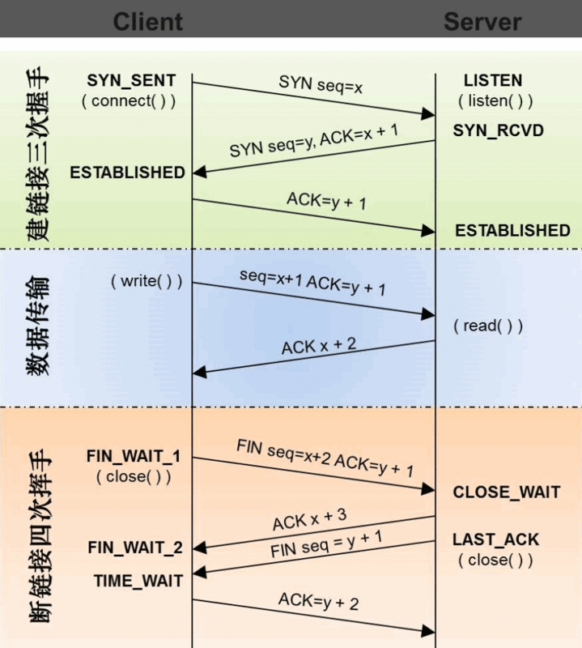

### 网页打开前的时间进行了哪些工作
* 给定一个网页资源地址后，浏览器检查本地缓存和应用缓存。
	* 如果之前获取过并且有相应的缓存信息(appropriate cache headers)(如Expires, Cache-Control, etc.), 就会用缓存数据填充这个请求，毕竟最快的请求就是没有请求(the fastest request is a request not made)。
	* 否则，我们重新验证资源，如果已经失效(expired),或者根本就没见过，一个耗费网络的请求就无法避免地发送了。
* DNS解析
* 三次握手/四次握手
	*  SYN > SYN-ACK > ACK(HTTPS协议还有一个ssl握手过程)

	* HTTP重定向的话，从头开始握手过程
*  Web浏览器向Web服务器发送请求命令 
*  Web浏览器发送请求头信息
*  Web服务器应答 
*  Web服务器发送应答头信息 
*  Web服务器向浏览器发送数据
*  Web服务器关闭TCP连接

## 工欲善其事必先利其器
### 用好Chrome Devtools
#### console的骚操作（例）
* congsole.log()、console.error()、console.warn()、console.info()
* console.table()
* console.group()
* console.assert()条件打印
* console.dir()

#### 检查无用的css/js
* more tools=>Coverage

#### 断点检查
* hover、active

#### 模拟断网进行错误处理
* offline

#### 用timeline/performance查看执行时间
* 格子代表帧率
* 黄色js CPU占有率
* 红色 失帧比较厉害
* 紫色css CPU占有率

#### 检查内存泄漏
* Memory=>profiles

#### 查看内存消耗
* Memory=>profiles=>ALLOCATION TIMELINES

## 浏览器并发请求数量问题
* 基于端口数量和线程切换开销的考虑,浏览器不可能无限量的并发请求
* 并非越大越好，基于良知和默契的考虑，保护浏览器和服务器更好的性能
* 迅雷、暴风影音等可以修改电脑的最大连接数
* 用户可以重写浏览器的默认值(IE)
* 目前浏览器的最大同域并发请求数量
	
Browser|Max
:--:|:--:
IE8,9| 6
Firefox|6
Chrome|6

* [已有解决方案](https://www.zhihu.com/question/20474326/answer/15696641)：domain hash, cookie free, css sprites, js/css combine, max expires time, loading images on demand