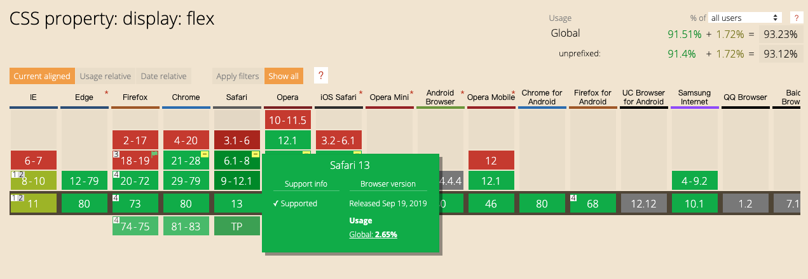

# 十分钟搞定Flex布局

### 阅读本文您将收获
* 布局的相关概念
* Flex布局的相关属性
* 面试中常问的Flex相关知识

## 为啥要Flex布局？因为贪婪！
* 在网页布局还未进入CSS时代的时候，布局往往通过 `<table>` 标签来实现
* 伴随着 `Web语义化` 时代的到来，人们不满足于简单的 `table 布局`，开始琢磨新花样
* `CSS标准` 为我们提供了三种基本的布局方式：`标准流`、`浮动布局`、`定位布局`
* 随着技术和人们对美的需求的发展，传统的布局显得不够灵活，所以就出现了今天要讲的 `flex` 布局

## Flex布局基本概念
* 2009年，W3C 提出了一种新的方案---- **Flex 布局**，意为“弹性布局”，可以简便、完整、响应式地实现各种页面布局。
* 兼容性方面它已经几乎得到了所有浏览器的支持，小程序都兼容，具体兼容性可以看下图。(什么？你老板要兼容IE6？让他滚~)



* 任何容器甚至行内元素都可以指定为flex布局

```
.box{
  display: flex;
  display: inline-flex; // 行内元素
  display:-webkit-flex; // Chrome & Safari
}
```

* 设为 Flex 布局以后，子元素的 `float`、`clear` 和 `vertical-align` 属性将失效
* Flex 布局有两个轴，一个是主轴(默认是水平方向)，一个是交叉轴(默认是垂直方向)

## 父容器属性
### `flex-direction` : 决定主轴的方向
* 四个值：
	* `row`(默认值)：主轴为水平方向，起点在左端
	* `row-reverse`：主轴为水平方向，起点在右端
	* `column`：主轴为垂直方向，起点在上沿
	* `column-reverse`：主轴为垂直方向，起点在下沿

### `flex-wrap`: 主轴的换行方式
* 三个值
	* `nowrap`(默认)：不换行
	* `wrap`：换行，第一行在上面
	* `wrap-reverse`：换行，第一行在下面

### `flex-flow`: `flex-direction` 和 `flex-wrap 的简写形式
* 默认值：`flex-flow: row nowrap;`

### `justify-content` : 主轴上的对齐方式
* 五个值
	* `flex-start`(默认)：从主轴开始排列
	* `flex-end`：从主轴结尾排列
	* `center`：居中排列
	* `space-between`：两端对齐排列，平分中间空间
	* `space-around`：两端开始排列，平分所有空间

### `align-items`: 交叉轴上的对齐方式
### `align-content`: 多根轴线的对齐方式(只有一根轴线，该属性不起作用)
## 子容器属性
### `order `: 排列顺序
### `flex-grow`: 放大比例
### `flex-shrink`: 缩小比例
### `flex-basis`: 占据的主轴空间
### `flex `: `flex-grow`, `flex-shrink` 和 `flex-basis`的简写
### `align-self`: 自定义的主轴对齐方式
