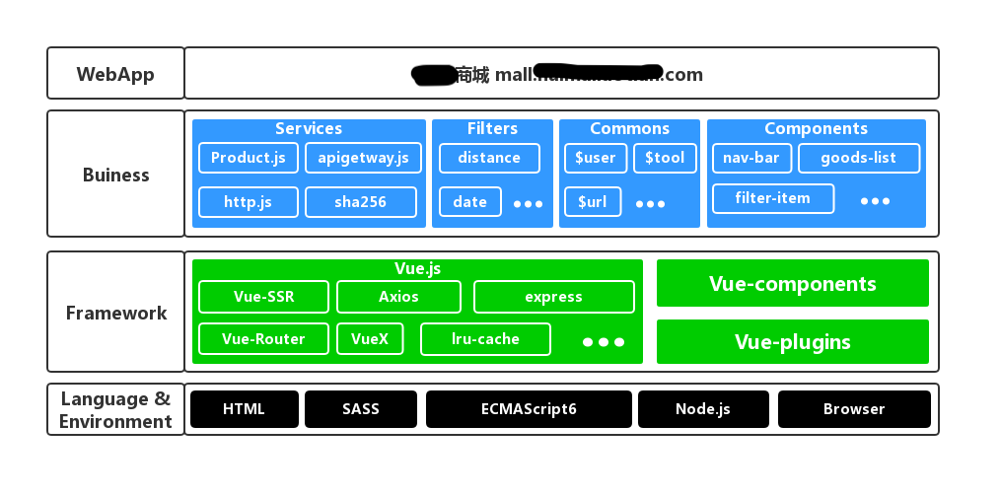

# 记一次惨痛的Vue-cli + VueX + SSR经历
> 前言介绍

> 此篇写于一年前，当时仅作为自己的个人项目总结，现在换了工作，就把之前的一些经验或教训发出来，以警后人，也为大家碰到相同问题时提供解决方案，或多或少有帮助您就点个赞，如果有问题或更好的解决方式请在评论中指出或关注公众号给我留言，感谢指点。

> 总部提出新项目，大致需求就是APP内置一个H5商城，于是开始出差去总部极限开发

## 技术选型
* 项目语言：HTML、CSS、JavaScript
* 项目框架：Vue.js
* 项目搭建脚手架：Vue-cli
* 工程化工具：Webpack、Sass、Npm
* 源码管理：Gitlab
* 运行环境：Browser & Node(PM2)
* 第三方服务：GrowingIO、高德地图、ECharts

## 技术方案
* 前后端分离
* 非单页面应用，多页面站点，评估时大概30多个页面，极限开发，直接使用 `Vue-cli`
* 产品考虑SEO，使用 `VueX` 做 `SSR` ( `Vue` 做 `SSR` 后续我会出文章说明实现方式和一些坑，有兴趣的可以点击关注获取最新文章)
* 便于开发，使用 `sass` 等工程化工具
* 确定开发规范和代码规范
* 根据项目需要，封装 `user.js`(针对用户信息存储), `base.js`(基础公共JS文件), `url.js`(针对url的操作), `http.js`(二次封装`axios`)
* 根据项目需求，抽象组件(`compoments`)和插件(`widgets`)注册到Vue实例
* 根据项目需要，合理设置`Router`和`Page`
* 根据接口及环境需要，设置必要的环境变量和接口地址
* 根据开发和生产需要，添加必要的依赖

## 以Node为服务器版本项目架构
* 整个网站的架构采用横向分层，从上往下越来越抽象，引用关系由上至下，拒绝由下至上的引用。
	* 语言&环境
	* 框架层
	* 业务公共层
	* 应用层



#### 语言&环境
* 语言：
	* 采用 `Html`和 `HTML5` 控制各个模块的结构；
	* 采用 `Sass` 做样式的预处理；
	* 采用 `ECMAScript 6` 来开发逻辑和交互，然后通过 `Webpack` 和 `Babel` 将高级版本的 JS 编译成当下流行浏览器能够解析的 `ECMAScript 5`。
* 环境：
	* Web 前端的代码主要运行在浏览器端，但是也能在 `Node` 环境运行，通过 `Vue-ssr` Node 端插件，同样的前端代码也可以通过服务器端将 `Html` 渲染出来。
	* 正式的部署中，`Node` 的进程管理是通过 `PM2（process manager 2）`，它可以帮你检查进程的健康情况，并提供强大的接口，让你很容易的了解 Node 在服务器中的运行情况。

#### 框架层
* 框架层主要解决：算法、存储、通讯和 UI 4 大问题。
	* `Vue`
* 核心框架采用 `Vue` 及其 `Vue` 系列插件：
	* `Vue-ssr` 服务器端渲染模块
	* `Vue-Router` 路由模块
	* `Vuex` 数据流模块
* 选择Vue作为核心框架的原因：
	* `Vue` 更加轻量级
	* `Vue` 入门成本更低
	* `Vue` 中文社区比较多，中文文档也翻译的很好
	* `Vue` 在 `GitHub` 中对问题的回复也很及时
	* `Vue` 语法更加忠于前端语言
	* `Vue` 的解决方案更加齐全

#### 公共业务层
* 主要解决站点的业务问题，例如：系统配置、获取用户信息、与后端接口的交互等。
* `Config`: 公共环境变量相关
* `Buiness`:
	* `user.js` 用户信息相关
	* `filter` 业务相关`filter`
* `Plugins`:
	* `bsae.js` 基础公共方法库(包括精准计算，手机号脱敏，格式化金额等等)
	* `cookie.js` 针对cookie操作公共方法
	* `gotoapps.js` hyBrid公共方法
	* `h5toapp.js`  hyBrid公共方法
	* `url.js`  针对url操作公共方法
	* `weixinShare.js`  分享公共方法
* `Components`:  公共组件
	* 筛选组件
	* 城市选择组件
	* 商品展示组件
	* 头部导航
	* 等等其他组件
* `Widgets`: 公共插件
	* 弹出Toast
	* 二次封装 Swiper 滑动插件
	* 滑动加载插件
	* 多选插件
	* 等等其他插件

#### 应用层
* 业务页面代码
	* 首页推荐页
	* 很多落地页
	* 商品列表页
	* 商品详情页
	* 商品管理页
	* 消息发布页
	* 等等其他页面

## 以Node为服务器版本存在的问题

> 项目提测后经过压测发现node服务器版本在并发量大的情况下出现内存溢出的问题，内存不断上涨导致容器内存溢出服务暂停，服务器探针检测到服务暂停后重新开始部署操作，导致站点出现502的情况(由于压测报告包含前东家信息，所以这里不给出压测报告的数据了)。

#### 内存溢出问题
* 分析原因
	* 高并发是node服务器的瓶颈，增加服务器端渲染后这个问题更加突出 [参考资料](https://gitbook.cn/books/591170568b2c1f0f85f3b8fb/index.html)
	* 服务器端渲染将数据大量存储在内存中，导致页面不销毁内存无法释放，内存猛增
	* 代码书写不规范，导致部分代码出现内存泄漏的情况
* 尝试解决方案
	* code review 后将部分内存泄漏释放掉	[参考资料](http://www.ayqy.net/blog/js%E5%86%85%E5%AD%98%E6%B3%84%E6%BC%8F%E6%8E%92%E6%9F%A5%E6%96%B9%E6%B3%95/)
	* 开启node多进程	[参考资料](https://blog.csdn.net/u012251421/article/details/76262949)
	* 开启组件缓存和页面缓存	[参考资料](http://www.ayqy.net/blog/js%E5%86%85%E5%AD%98%E6%B3%84%E6%BC%8F%E6%8E%92%E6%9F%A5%E6%96%B9%E6%B3%95/)

#### PM2监控问题
* 分析原因
	* 公司服务器上探针检测代码健康，内存溢出导致pm2重启时，健康检测不通过导致项目重启

#### 多线程问题
* 分析原因
	* 为应对内存溢出问题，增加了多线程和组件缓存以及页面缓存，但是机器的CPU压力和内存压力也同时增大

#### 服务器端渲染接口请求报错
* 分析原因
	* 服务器端获取传参错误，导致部分接口请求报错，页面阻塞

#### 服务器端内存分配不合理
* 分析原因
	* 由于是测试环境，前端后端两个项目在同一台机器上，内存分配不合理，压测大量的请求都积攒在前端，导致后端接口持续等待

#### 服务器硬件准备不足
* 分析原因
	* 压测均在测试环境进行，测试环境服务器本身配给不足，也没有做负载均衡，请求量激增导致服务器扛不住了

## 部分解决方案技术实现
#### 释放因代码产生的不必要内存消耗
* 释放因错误书写导致的多余内存消耗

```
// 1. 挂载的隐式变量
fun(e) {
	// JS 的变量提升将其挂载到全局
	bar = "this is a hidden global variable"; // 使用let进行声明
}
// 2. 直接调用的外部构造函数
fun() {
    this.variable = "potential accidental global";
}
this.fun(); // 将直接执行外部构造函数改为new继承创建
```

* 释放时间器或callback未销毁产生的内存消耗

```
//1. 使用结束时候清除定时器
let timer = setInterval(() => {
    // do something
}, 1000);
clearInterval(timer)
//2. 使用结束清除回调
let element = document.getElementById('button');
element.addEventListener('click', onClick);
element.removeEventListener('click', onClick);
element.parentNode.removeChild(element);
```

#### 开启多线程
* 利用node 的 `cluster` 模块可以创建共享服务器端口的子进程
* [参考官方文档](http://nodejs.cn/api/cluster.html)

```
const cluster = require('cluster')
const numCPUs = require('os').cpus().length

if (cluster.isMaster) {
    console.log('Master is running');
    for (var i = 0; i < numCPUs; i++) {
        cluster.fork();
    }
    cluster.on('exit', function (worker, code, signal) {
        console.log('worker ${worker.process.pid} died');
    });
} else {
    app.listen(port, () => {
        console.log(`server started at localhost:${port}`)
    })
}
```

#### 使用 LRU-Cache 管理缓存
* 设置页面缓存

```
// server.js
const LRU = require('lru-cache')
const microCache = LRU({
    max: 100, // 最大缓存的数目
    maxAge: 1000 // 过期时间
})
const isCacheable = req => {
    // 判断是否需要页面缓存
    if (req.url && req.url === '/') {
        return req.url
    } else {
        return false
    }
}

app.get('*', (req, res) => {
    const cacheable = isCacheable(req)
    res.setHeader('Content-Type', 'text/html')
    if (cacheable) {
        const hit = microCache.get(req.url)
        if (hit) {
            return res.end(hit)
        }
    }
    const errorHandler = err => {
        if (err && err.code === 404) {
            // 未找到页面
            res.status(404).sendfile('./assets/error/500.html');
        } else {
            // 页面渲染错误
            res.status(500).end('500 - Internal Server Error')
            console.error(`error during render : ${req.url}`)
            console.error(err)
        }
    }
    const context =  { url: req.url }
    renderer.renderToString(context, (err, html) => {
        if (err) {
            return errorHandler(err)
        }
        
        if (context.initialState && context.initialState.htmlHead) {
            res.write( indexHTML.head
                .replace('<!-- TITLE -->', context.initialState.htmlHead.title)
                .replace('<!-- METAS -->', context.initialState.htmlHead.metas)
                .replace('<!-- SCRIPTS -->', context.initialState.htmlHead.scripts)
                )
        }
        res.write(html);

        if (context.initialState) {
            res.write(
                `<script>window.__INITIAL_STATE__=${serialize(context.initialState, {
                    isJSON: true
                })}</script>`
            )
        }

        res.end(indexHTML.tail)
        // 设置当前缓存页面的内容*/
        microCache.set(req.url, html)
    })
})
```

#### 调整node内存大小的使用限制
* 在 build 或者 运行node环境的时候进行更改

```
"build": "node --max_old_space_size=4096 build/build.js"
```

#### PM2进程监控策略
* 提高监控阈值

```
pm2 start app.js --max-memory-restart 1024M
```

## 改进后的压测数据
### 测试环境压测数据
* 压力：两千个并发持续半小时

### 测试环境压测结果
* 应用程序性能满意度为0.525(范围在 0-1之间，1表示达到所有用户均满意)
* 请求通过率99.5%，失败率0.5%。
* 半小时的压测请求总数为三万，服务共重启三次，平均请求完成时间 6996.15ms ，最大请求完成时间 601994ms ,最小请求完成时间 381ms。

### 生产环境压测数据
* 压力：一万个并发持续半小时

### 生产环境压测结果
* 压测开始后瞬间服务器压力猛增
* 压测10分钟响应时间超过10秒
* 压测10分钟到20分钟期间服务器内存溢出，探针检测到溢出自动重启服务器，项目出现502情况

## 最终解决方案
> 由于开发时间紧张，在上述处理方案进行改进后，压测的效果好了一些，但是还是达不到理想的要求，所以最终我们放弃使用node作为服务器底层。

* 修改底层框架，去除 `node` 服务器端相关配置，改由打包后直接由 `nginx` 做路由转发，不再使用 `node` 服务器作为底层分发服务器
* 修改后的架构仍然维持了 `node` 服务器版本的绝大部分架构，去掉了部分不再需要用到的依赖，并增加了 `keep-alive` 缓存，并将部分静态支持JS文件改由 `npm 依赖包` 获取，如 `sha256 算法`等
* 在服务器端，在纯净 `node 镜像` 的基础上增加 `Nginx` ，并配置，将打包的过程放在 `node` 服务器上，打包成功后直接由 `nginx` 代理转发

## Nginx版本架构
#### 语言&环境
* 仅仅是环境层面的变化，将以`node`作为服务器改为开发使用`node`服务器，生产测试均使用`node`打包，利用`Nginx`进行转发，打包配置更加简洁

#### 框架层
* 核心框架层仍然采用Vue，只是去除了VueX，Vue-SSR，增加使用了keep-alive进行页面缓存
* 不再累赘过多的`VueX`进行状态存储与组件通讯

#### 公共业务层
* 公共业务层不做修改，仅仅是将代码层级的错误引用和内存消耗修改掉

#### 应用层
* 应用层不做修改

## Nginx版本项目压力测试报告
* 性能优异，测试环境和生产环境压力测试未见异常，压测通过

## 项目总结
