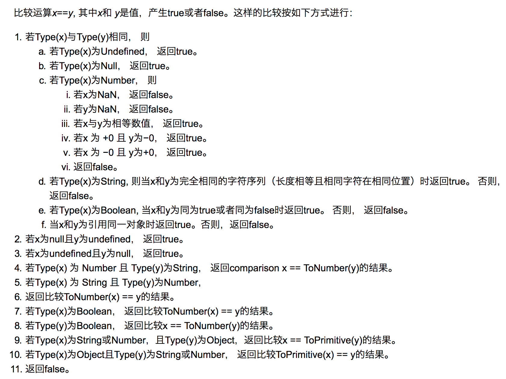

# 数据类型
## 原始数据类型（基本数据类型）
### 种类
* number 、boolean、 string、null、 undefined、symbol(新增)、bigInt(新标准，兼容性很差)

### 特性
* 保存在 **栈内存** 中的简单数据段
* 数据是不可变的，即不能强行修改 `Array.prototype.sort.call('abc');(会报错)`
* 没有作用域链中的 `_proto_` 属性

### 检测
* 使用typeof可以检测基本数据类型
* 但是 `typeof(null) == 'object'`
	* `null` 得到检测错误是历史遗留问题，在 `JS` 的最初版本中使用的是 32 位系统，为了性能考虑使用低位存储变量的类型信息，`000` 开头代表是对象然而 `null` 表示为全零，所以将它错误的判断为 `object` 。

## 引用数据类型
### 种类
* Object (包含普通对象-Object，数组对象-Array，正则对象-RegExp，日期对象-Date，数学函数-Math，函数对象-Function)

### 特性
* 引用类型正在创建时会分配两个空间
	* 一块在 **_堆_** 上，储存引用类型本身的数据（当然数据量会比较大）
	* 一块在 **_栈_** 上，储存对堆上数据的引用（存储堆上的内存地址，也就是指针）
* 引用类型是可变的：即 `let a={}; a.x=1;`
* `function` 参数是值传递，**不能修改引用**

### 检测
* 通过 Object.prototype.toString.call 检测最为精准

```
// Vue 源码的检测方法
let _toString = Object.prototype.toString;

function toRawType (value) {
    // 获取 从第九个到倒数第二个字符
    // 比如 [object string]  获取 string
    return _toString.call(value).slice(8, -1)
}

// 严格的对象类型检查，只返回true
// 这里主要用于普通的javascript对象

function isPlainObject (obj) {
	return _toString.call(obj) === '[object Object]'
}
```


## 0.1 + 0.2为什么不等于0.3？
* JS的精确度区间 约为正负 2^53，超出限制会截断。所以你看到的 0.1 不是真的 0.1。
* 计算机无法识别十进制，JS会将十进制转换为对应的二进制（二进制即：0 和 1）。0.1和0.2在转换成二进制后会无限循环，由于标准位数的限制后面多余的位数会被截掉，此时就已经出现了精度的损失，相加后因浮点数小数位的限制而截断的二进制数字在转换为十进制就会变成0.30000000000000004。
* 高精度计算函数

## 对象转原始类型是根据什么流程运行的？
对象转原始类型，会调用内置的[ToPrimitive]函数，对于该函数而言，其逻辑如下：

如果Symbol.toPrimitive()方法，优先调用再返回
调用valueOf()，如果转换为原始类型，则返回
调用toString()，如果转换为原始类型，则返回
如果都没有返回原始类型，会报错

```
var obj = {
  value: 3,
  valueOf() {
    return 4;
  },
  toString() {
    return '5'
  },
  [Symbol.toPrimitive]() {
    return 6
  }
}
console.log(obj + 1); // 输出7
```

## JS 中的比较运算


## JS 中的 '真' 值
* JS 中除了 '假' 值就是 '真' 值
* '假' 值共有七个
	* undefined
	* null
	* false
	* NaN
	* ''
	* 0
	* -0
* 在条件判断的隐式转换中："假" 值会转换为 false，"真" 值会转换为 true;

## [] == ![]
* 类型转换都是先 `valueOf() `然后再 `toString()`
* 右边
	* 由于 ! 优先级比 == 高，先执行 !， 所有 `typeOf()` 为 `object` 转 `Boolean` 都是 `true`
	* `![]` 得到 false
	* 进行 相等性判断
	* false 转化为数字 0

* 左边
	* 执行 `[].valueOf()` 原始值 还是 `[]`
	* 执行 `[].toString()` 得到 `""`
	* `""` 转化为数字 `0`

所以：`0 == 0` ，答案是 true

## 如何让if(a == 1 && a == 2)条件成立

```
var a = {
  value: 0,
  valueOf: function() {
    this.value++;
    return this.value;
  }
};
console.log(a == 1 && a == 2);//true
```