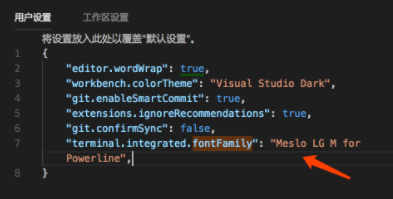

> 之前一直用 MAC OS 自带的终端进行操作，但总感觉差点事，于是在同事的介绍下，用上了iTerm2，结合 on my zsh 之后发现很强大，正式入坑

## 安装iTerm2
* 方式一
	* [下载地址](https://www.iterm2.com/index.html)
	* 解压之后便是执行程序文件
* 方式二
	* 使用 MAC OS 自带的 Homebrew 进行安装 `$ brew cask install iterm2`
	* 电脑缺少 Homebrew 的同学可点击这里尝试安装

## 配置iTerm2主题(可选)
* 推荐一个主题 Solarized Dark theme [下载地址](http://ethanschoonover.com/solarized)
* 解压文件，打开 ` Preferences -> Profiles -> Colors -> Color Presets -> Import `，选择刚才解压的 ` solarized->iterm2-colors-solarized->Solarized Dark.itermcolors `文件，导入成功，最后选择 Solarized Dark 主题，关掉终端重启就大功告成了

## 配置 On My Zsh
* Oh My Zsh 是对主题的进一步扩展
* MAC OS 是自动集成Zsh的，查看本地Zsh ` Zsh --version `
* 一键安装 Oh My Zsh

``` 
$ sh -c "$(curl -fsSL https://raw.github.com/robbyrussell/oh-my-zsh/master/tools/install.sh)" 
```

* 把 Zsh 设置为当前用户的默认 Shell（这样新建标签的时候才会使用 Zsh）  ` $ chsh -s /bin/zsh `
* 编辑 ` vim ~/.zshrc ` 文件，将主题配置修改为 ` ZSH_THEME="agnoster" ` 
* agnoster 主题是比较常用的主题，这里还有一份[Zsh的主题列表](https://github.com/robbyrussell/oh-my-zsh/wiki/themes)

## 配置Meslo字体
* 使用上面的主题就需要支持 Meslo 字体，不然会出现乱码的情况
* [字体下载地址](https://github.com/powerline/fonts/blob/master/Meslo%20Slashed/Meslo%20LG%20M%20Regular%20for%20Powerline.ttf)
* 下载成功直接安装
* 然后在 iTerm2 中 ` Preferences -> Profiles -> Text -> Font -> Chanage Font ` 选择 ` Meslo LG M for Powerline ` 字体
* 如果字体大小不满意，可以一并修改

### VS Code 字体配置
* 经常使用 VS Code 的朋友还需要修改 VS Code 的字体配置
* 用户配置，搜索fontFamily，然后将右边的配置增加 

``` 
"terminal.integrated.fontFamily": "Meslo LG M for Powerline" 
```

* 配置信息

	

* 效果就是酱紫 
	
	
## 使用手册
