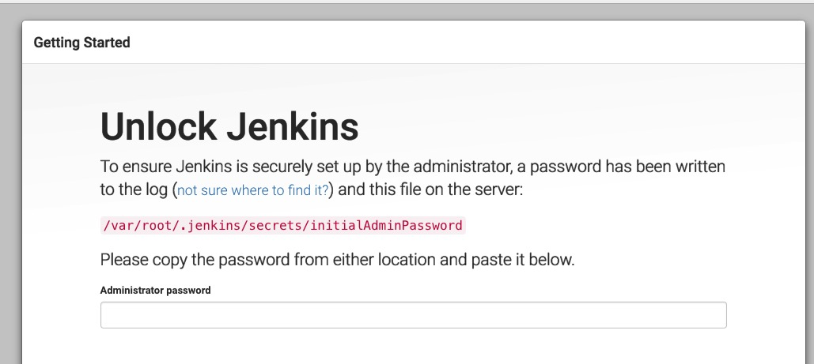
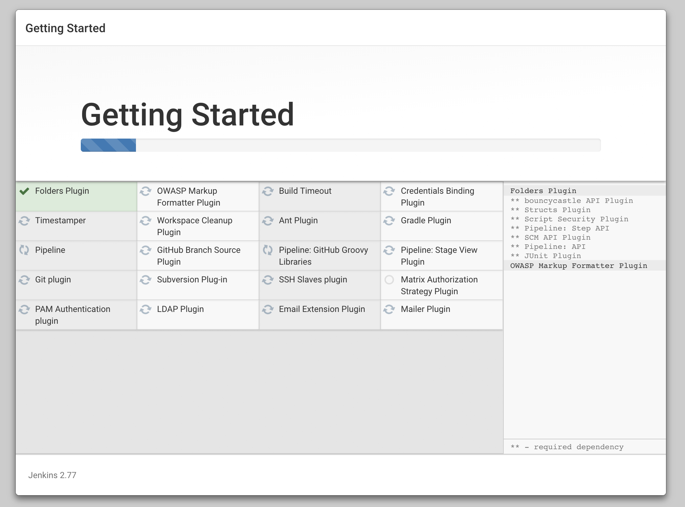

## 自动化构建环节
### 流程管理
* 完整的开发流程包括本地开发，mock调试，前后端联调，提测，上线等。在每个团队的基础设施当中，都会存在一定程度将前端开发流程割裂。如何运用自动化的手段，对开发流程进行改善将可以大幅降低时间成本。

### 版本管理
* web应用规模愈加复杂，迭代速度也愈加频繁。而前端界面作为一种远程部署，运行时增量下载的特殊GUI软件，如何使用自动化构建工具，对不同版本的资源文件进行管理，并让用户第一时间感知版本的回撤以及升级（尤其是在浏览器缓存以及cdn广泛使用的今天），将对企业有更好的安全保障，对用户有更佳的使用体验。

### 资源管理
* 随着每个团队业务复杂程度的加深，对于功能模块封装的粒度必将愈加精细。衍生出来的，将会是资源数量以及依赖关系等的管理问题。以人工的方式考虑单个页面或单个功能的资源优化是片面的，并且效率低下。通过工程化的手段，在前端构建过程中自动化地以最优方式处理资源的合并以及依赖，是提升性能以及解放人力资源的重要途径。

### 组件化
* 组件化方案，是以页面的小部件为单位进行开发，在系统内可复用。如何以最优化方式实现组件化（js、css、html片段，以就近原则进行文件组织，以数据绑定方式进行代码开发，业务逻辑上相对外部独立，暴露约定的接口）；并且随着组件化的程度加深，如何对组件库进行管理，合并打包以及多人共同维护等，都是无法避免的问题。

### 脚手架工具
* 我们希望每次研发新产品不是从零开始，不同团队不同项目之间能有【可复用的模块】沉淀下来。对于前端而言，【可复用的模块】除了【组件】，另外就是【脚手架工具】。运用脚手架工具，一键安装，自动化搭建不同类型项目的完整目录结构，工程师将有更多时间专注在业务逻辑代码的编写上。

## 技术元素
* webpack 打包工具 资源管理
* vue 组件化方案
* git 版本管理
* pm2  流程管理
* Jenkins 持续构建工具

## 构建过程

### node环境安装（自行百度）
* 检测：node -v

### npm安装（自行百度）
* 检测：npm -v

### 确定目录结构
* 项目名称（域名）
* 配置文件
* 业务级别
* 框架级别
* 必须与非必须

### 本地测试代码
* 安装vue-cli构建工具：npm install vue-cli -g 
* 创建vue项目：vue init webpack <project name> 
* 进入目录并下载依赖包：npm install
* 启动项目：npm run dev

###搭建Git仓库

####方案一：利用现有git管理系统
* github创建空仓库
* 初始化git仓库：git init
* 添加远程版本库：git remote add origin <url>
* 提交更新：git commit -m "提交信息"
* 跟踪更新：git add .
* 上交更新：git push <branch>

####方案二：搭建本地git仓库
* mac自动集成 git 和 Python 环境
	* git --version
	* python --version
* git clone git@github.com:tv42/gitosis.git
* sudo python setup.py install
* 制作公钥 ssh-keygen -t rsa
* cp id_rsa.pub /tmp/zhangxiaobin.pub 生成的pub文件放置
	* 首先通过 su 切换到 local 账户（只有在同一台机器上才有效），然后进入到 local 账户的 home 目录，使用 ssh-keygen -t rsa 生成 id_rsa.pub，最后将该文件拷贝放置到 /tmp/zhangxiaobin.pub，这样 git 账户就可以访问 zhangxiaobin.pub了，在这里改名是为了便于在 git 中辨识多个 client。
* 使用 ssh 公钥初始化 gitosis
	* gitosis git$ sudo -H -u git gitosis-init < /tmp/zhangxiaobin.pub
* cd .ssh 对authorized_keys文件进行修改
	* "command="gitosis-serve yourname",no-port-forwarding,no-X11-forwarding,no-agent-forwarding,no-pty " 删除
	* 这一行删除了就是拥有管理员权限了，如果不删除，报错ERROR:gitosis.serve.main:Repository read access denied
fatal: Could not read from remote repository.
* 对 post-update 赋予可写权限，以便 client 端可以提交更改。
	* gitosis git$ sudo chmod 755 /Users/git/repositories//gitosis-admin.git/hooks/post-update
	* 这样在其他账户下也能对仓库进行配置管理，而无需使用服务器的git账户进行
* 修改git账户的PATH路径

```
zhangxiaobin:gitosis git$ touch ~/.bashrc
zhangxiaobin:gitosis git$ echo PATH=/usr/local/bin:/usr/local/git/bin:\$PATH > .bashrc
zhangxiaobin:gitosis git$ echo export PATH >> .bashrc
zhangxiaobin:gitosis git$ cat .bashrc 
PATH=/usr/local/bin:/usr/local/git/bin:$PATH
export PATH
```

* 本地管理 gitosis-admin
	* 进入 gitosis-admin 目录
	* gitosis.conf 文件是一个配置文件，里面定义哪些用户可以访问哪些仓库，我们可以修改这个配置；
	* keydir 存放ssh公钥


### pm2守护进程
* pm2的优势
	* Log aggregation
	* API
	* Terminal monitoring
	* JSON configuration
* 安装
	* 通过npm进行安装 npm install -g pm2
* 测试pm2
	* pm2 start server.js --name 'server'

	```
	var http = require('http');
http.createServer(function (req, res) {
    res.writeHead(200, { 'Content-Type': 'text/plain' }); res.end('Hello World\n'); 
}).listen(8888); 
console.log('Server running at localhost:8888/');
	``` 
* 查看应用运行状态
	* pm2 list
* 追踪资源运行情况
	* pm2 monit
	
### 搭建jenkins持续构建
* Jenkins是一个基于Java开发的一种持续集成工具，用于建工持续重复的工作，功能包括：
	* 持续的软件版本发布/测试项目
	* 监控外部调用执行的工作。
* 环境基础
	* java环境
	* tomcat服务器
		* sudo sh startup.sh //启动
		* sudo sh shutdown.sh //关闭
* 打开jenkins
	* 一：jenkins.war放于tomcat/webapps目录下，本地打开jenkins
	* 二：Java –jar jenkins.war –httpsPort=8080 –httpPort=-1 
* 输入密码
	* 修改文件权限：sudo chmod -R 777 root
	


* 安装插件

 

* 新建项目(项目演示)