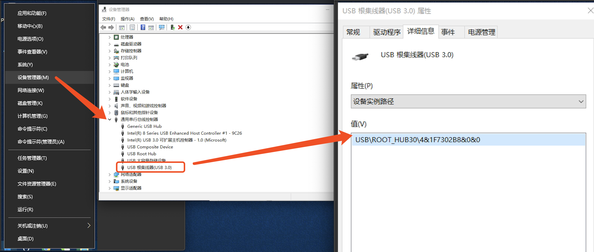

### 优盘不可复制或移动4GB以上的文件
* 原因：电脑分区系统默认一般是FAT32的，对于FAT32是微软很早的文件系统来说，也是经常用于移动设备上面的系统，这个文件系统是有限制的，那就是只能放小于4GB的单个文件。
* 解决方案：
	* 格式化优盘：先备份优盘中的文件，优盘右键选择格式化
	* 选择文件系统为NTFS并开始
	* 完成后再Windows系统中就可以轻松复制较大的文件了
* MacOS与windows有区别
	* Mac OS X 不支持对 NTFS 的写入。反过来 Mac OS X 的 HFS+ 磁盤格式 Windows 也是不能写入的。这两家公司历来如此。
	* 如果你的U盤里东西不多，那麼先备份好资料，因为 Mac 是支持读取的，你可以先保存下来，然後把U盤格式化成ExFAT格式，这个格式 Mac 和 Windows 都是支持读和写的，而且支持4GB以上的单文件。
* FAT和FAT32着两种磁盘格式不能够传输大小超过4GB的单个文件的原因
	* FAT32文件系统是用一个整数来表示一个文件大小的，比方说一个文件是1KB（1024B）那么系统就会用1024这个整数来表达这个大小。那么系统原始类型中最大的正整数是多少？2^32-1，系统是由0开始计数的，由0代表容量为1B的文件，那麼2^32-1就代表2^32B的文件，也就是4GB。

### WIN 10 下部分USB设备显示 U盘设备描述符请求失败 
* 找到资源管理器(Windows图标右键) -> 通用串行总线控制器 -> 有问题的USB设备(右键) -> 属性 -> 详细信息 -> 设备实例路径 -> 把值记录下来，下一步会用到

* 打开注册表(win + R 后输入 regedit 后 点击确定) -> 按照路径找到该USB设备的属性(路径：)
* 增加或修改属性 (名称: `EnhancedPowerManagementEnabled` 值: `0`) -> 保存

* 如果这时USB设备即时识别了就大功告成，若未即时识别，请将USB设备移除后重启电脑再插上即可

### 华为手机连接 MAC Android studio 不识别
* 打开 开发者模式 确认 < USB 调试 > 打开
* 确认 < 监控 ADB 安装应用 > 打开
* 若还不识别
	* 在拨号界面输入 `*#*#2846579#*#*` 进入工程模式
	* `后台设置` -> `USB端口设置` 改成 `GOOGLE模式`